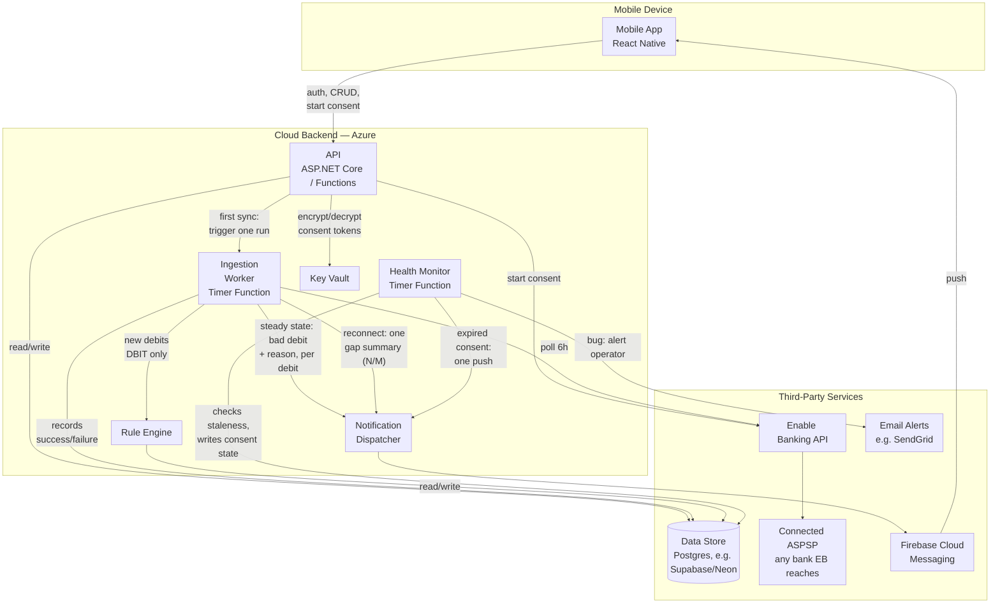
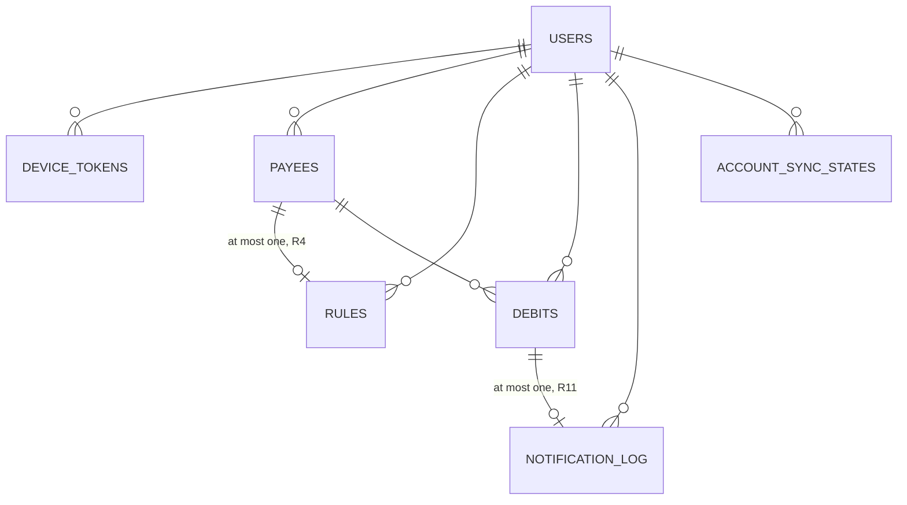

# Architecture

Status: decided at a high level; not yet implemented. Written after the mocks settled, per the
project's mocks-first ordering, then **reconciled with `REQUIREMENTS.md` on 2026-08-17** — all
`A1`–`A10` divergences are closed; see "Reconciliation with `REQUIREMENTS.md`" near the end for
the map.

## Component diagram

| Component | Tech | Execution place | Responsibility |
|---|---|---|---|
| Mobile App | React Native | Mobile device | UI (debit list/detail, rules, settings), receives push, in-app classification |
| API | ASP.NET Core / Azure Functions (HTTP), C# | Cloud backend | Auth, payee/rule CRUD, debit history, brokers Enable Banking consent flow |
| Ingestion Worker | Azure Functions (Timer), C# | Cloud backend | Polls every 6h per consent (retries transient failures); also invoked once, immediately, by the API right after a consent is granted (the one-time first-sync exception — see "Transaction ingestion"). No other on-demand trigger; records success/failure per consent. Drops credits (R2a). Runs in one of three modes — see "Ingestion modes" |
| Health Monitor | Azure Functions (Timer), C# | Cloud backend | Daily check for consents stuck failing 20h+; expired consents get a user-facing banner **and one push**, everything else an email alert to the operator |
| Rule Engine | C# | Cloud backend | Resolves payee → applies that payee's rule (R5) → returns each debit's good/bad result **with the reason** (R12a). Mode-agnostic: it classifies the same way regardless of which ingestion mode the tick is running — it does not decide whether or how anything gets sent |
| Notification Dispatcher | C# | Cloud backend | Sends via FCM. In the built code this is `INotificationSender` taking a plain `PushMessage(Token, Title, Body)`: the runner supplies R12a's reason text for one bad debit (Steady state) or R20's summary text with N/M counts (Reconnect, built by `ReconnectSummary`); the sender never decides which to send, only delivers what it's given |
| Key Vault | Azure Key Vault | Cloud backend | Holds the encryption key for BankConsent tokens |
| Data Store | Postgres (free tier, e.g. Supabase/Neon — both idle-pause on their free tier, see "Cost") | Third party | Users, BankConsents (encrypted), Payees, Rules, Debits, NotificationLog, DeviceTokens, poll status per consent |
| Enable Banking API | PSD2/XS2A aggregator | Third party | Consent flow, transaction feed |
| Connected ASPSP | Any bank Enable Banking reaches | Third party | Source of truth for the account's transactions. N26 is the first one integrated, not a fixed dependency (R22) |
| Firebase Cloud Messaging | Push service | Third party | Push delivery to APNs + Android |
| Email Alerts | e.g. Brevo (free, 300/day forever, no card — verified 2026-09-28; SendGrid's free tier ended May 2025) | Third party | Notifies the operator when ingestion is failing for a non-consent reason |

**Current state vs. this table (2026-09-23, notification bullet step 7):** the Ingestion Worker
row above is the target design. What actually runs today, built and device-verified in the
notification tracer bullet's step 6, is a `BackgroundService`/`PeriodicTimer` **in-process inside
the same ASP.NET Core host as the API** — not a separate Azure Function. Deliberate and scoped
("the worker stays in-process for this bullet," `NOTIFICATION-TRACER-BULLET.md` step 6): moving it
to its own Azure Function is deferred, not decided against. **When that migration happens, it must
use the isolated worker model** (verified 2026-09-28): Azure retires support for the in-process
.NET model on 10 November 2026, and the isolated model is the only one that supports .NET 9/10/11
— since the backend already targets net10.0, in-process was never actually an option here anyway.

## Data model — tables and relationships

Read from the real schema (`backend/GreedyNose.Api/Data/`, EF Core, 6 migrations as of
2026-09-29) — this reflects what's built, not just designed. Column-by-column detail stays in the
entity classes, which are the single source of truth; this is only the shape a caller can't safely
guess from one table's own columns.

| Table | Key | What it holds |
|---|---|---|
| Users | `Id` | Anchor for every other table's `UserId`. No auth fields yet — one seeded row, single-user (R22a) |
| DeviceTokens | `Id`, unique on `Token` | One FCM token per install; re-registering the same token upserts, never duplicates |
| Payees | `(UserId, Id)` | `Id` is R3a's resolved payee key, stored verbatim — not a generated id |
| Rules | `(UserId, PayeeId)` | The key **is** the composite FK to Payees — a payee has at most one rule by construction (R4), not by application logic |
| Debits | `(UserId, Id)`, indexed on `(UserId, AccountKey)` | `Id` is R10b's resolved debit identity (`entry_reference` or the composite fallback), stored verbatim. The `AccountKey` index backs the per-account dedup read in the ingestion tick — it is no longer the mode signal (see AccountSyncStates) |
| AccountSyncStates | `(UserId, AccountKey)` | One row per connected account, and it **exists only once that account's first sync has finished**: `FirstSyncCompletedAt` says when. A missing row means "first sync still to do" — the Ingestion Worker's mode signal (see "Ingestion modes"). The second field, nullable `LastSessionIdHash`, is the SHA-256 of the consent session the last completed tick used — a **hash, never the session id**, which reads the real account and so is not something to add to the database; equality is all the reconnect check needs. `null` means "written before this field existed" and is adopted silently. `AccountKey` is the IBAN, never the per-consent `uid`, so a reconnect finds its own row. Keyed per account, not per user, so several accounts per user need no re-keying later (v1 is one account per bank, R22a) |
| NotificationLog | `Id`, unique on `(UserId, DebitId)` | R11's guard **at the database level**: the unique index makes a second send fail on insert, not just on an application-level check-then-insert that could race |

**Every table but Users is keyed with a composite `(UserId, …)`**, not a bare id — deliberate, so a
real multi-user login later needs no re-keying (R22a's single-user scope is a v1 limit, not a
schema one).

**Delete behavior is asymmetric on purpose, and it's the one thing worth knowing before touching
any of this:** `UserId → Users` cascades (account deletion, R18, must empty every table). Every
other cross-table FK — Rule→Payee, Debit→Payee, NotificationLog→Debit — is `NoAction`, refusing a
lone parent delete instead of silently taking its children along. Two consequences that aren't
obvious from either table alone: a payee "upsert" written as delete-and-reinsert would silently
wipe the user's rule if this weren't enforced, and deleting a debit could otherwise erase its
`NotificationLog` row — which would make the next fetch see that debit as new and re-notify,
breaking R11.

**`BankConsents` doesn't exist as a table**, despite the component table above listing it under
Data Store. The real consent store is a gitignored file (`ConsentStore`, `consent.local.json`),
not Postgres — a deliberate, narrower stand-in scoped to this tracer bullet (single user, no need
for a real table yet), the same kind of built-vs-designed gap as the Ingestion Worker row above.

## Client

**React Native.** Considered .NET MAUI and Flutter.

- Mocks in `mocks/` are Flexbox HTML/CSS by deliberate choice, so they map closely to RN
  components.
- Given the intent to commercialize later, RN's ecosystem (subscription/monetization SDKs
  like RevenueCat, analytics, A/B testing) and larger hiring pool tipped the decision over
  Flutter. Flutter's main edge (pixel-consistent rendering, smoother animation) matters less
  for this app's plain list/card/settings UI.
- MAUI was attractive given existing C# experience, but was dropped due to a thinner
  ecosystem for the two riskiest integrations (bank consent webview flow, push
  notifications).

## Backend

Separate service from the client — its language doesn't need to match RN. **ASP.NET Core /
Azure Functions (C#)**, leveraging existing team experience for the reliability-critical half
of the system.

Components:

- **API** — auth, payee/rule CRUD, debit history for the app's list/detail screens, and
  brokering the Enable Banking consent flow (session start + redirect callback, encrypted
  token storage).
- **Ingestion worker** — see below.
- **Rule engine** — see below.
- **Notification dispatch** — Firebase Cloud Messaging (unified path to APNs + Android).
- **Data store** — Users, BankConsents (encrypted), Payees, Rules, Debits (cache), and a
  light NotificationLog.

### Rule engine

The Rule Engine never resolves a payee or decides what's new — that happens upstream, in the
Ingestion Worker's pipeline (see "Debit identity" for the exact order). By the time a debit reaches
the Rule Engine, its payee is already resolved and it's already been identified as new and booked.
The Rule Engine's whole job is: read that payee's rule, apply R5 exactly as the spec states it, and
return the result to its caller (the Ingestion Worker) — it does not call the Notification
Dispatcher itself; see "Ingestion modes" for who does and when:

| Rule for the payee | Result | Reason returned |
|---|---|---|
| No rule | **bad** | `NoRule` |
| Bad | **bad** — the amount is **not** consulted | `MarkedBad` |
| Good, no amount | **good** | — |
| Good, amount set, debit ≤ amount | **good** | — |
| Good, amount set, debit > amount | **bad** | `OverLimit` (carries the limit) |

Two details are easy to get backwards and both break R1 if they are:

- **The amount belongs to the *good* branch only.** A bad payee alerts on every charge, whatever
  its size. Evaluating a leftover limit for a bad payee would silence exactly the payees the user
  flagged on purpose. (This was `A1`, and it was written the wrong way round here until
  2026-08-17.)
- **Equality is good** (R5a): a charge exactly equal to the limit does not exceed it, so `>`,
  never `>=`.

The comparison uses the **booked amount in the account currency** (R16) — what actually left the
account. If the bank also reports an original foreign amount, it is passed through for display on
the debit detail screen and never enters the comparison. There is no currency conversion anywhere
in the backend.

The engine does not word the notification; it hands over the reason and lets the dispatcher
render R12a's title and body. Keeping the wording in one place means the three bodies ("You
haven't reviewed this payee yet", "You marked this payee as bad", "Over your limit of «limit»")
cannot drift from the reasons that produce them. The first body deliberately avoids claiming the
payee is unfamiliar — `NoRule` also covers a payee the user chose not to review during onboarding
(R26a), who has visible history in the user's own Debits list.

### Classification is derived, never stored

Good/bad is **computed at read time** from the payee's current rule (R6) and never written onto
the debit record. R7 requires a rule edit to re-label that payee's existing debits immediately;
derived classification gets that for free, whereas a stored flag would need a re-labelling job
over history on every rule edit — more moving parts, and wrong in the window before it finishes.

The one thing that *is* persisted is **whether a debit has been seen before** (R10b) and whether
a notification was sent for it (NotificationLog). That is what keeps R10a honest: a debit that
turns bad later because the user edited a rule is re-labelled in the list on the next read, but
it is not new, so nothing notifies.

## Payee identity

Two different matching problems live in this system and they must not share a key:

| | Question | Key |
|---|---|---|
| **Payee identity** | "Is this the same party as last time?" | best-effort, this section |
| **De-duplication** | "Have I already seen this exact charge?" | `(account, entry_reference)`, see "Debit identity" |

**The exact key R3a wanted does not exist.** Enable Banking's support confirmed on 2026-08-17
that their transaction model carries no SEPA creditor identifier and no mandate ID, and they
could not point to a passthrough or roadmap item that would expose one — even though N26's own
PSD2 interface publishes both. `A6` is therefore designed around its absence rather than waiting
for it.

The key is two-tier, matching their own recommendation:

1. **Normalized creditor account identification** — the IBAN, where the charge carries one.
2. **Normalized name** (uppercase, strip digits and extra whitespace), plus the **creditor agent**
   (the creditor's own bank, typically by BIC, as reported — inconsistently — by the ASPSP)
   where it separates two payees that would otherwise collide.

`reference_number` is explicitly not usable here: it is intended for credit-transfer references.

Consequences for the design:

- **Store every raw string ever seen for a payee**, alongside the resolved key (R3a) — specifically
  a **distinct set** (not a full occurrence log with duplicates/timestamps) of each of the three
  fields the key itself is built from: creditor account/IBAN, normalized name, and creditor
  agent/BIC. This is not bookkeeping — it is the only way to re-tune matching later against what
  banks actually sent, instead of guessing, and keeping exactly the fields the key uses is what
  that re-tuning pass needs. See "Refining these from real data".
- **When matching is uncertain, split rather than merge** (R3b). A split shows a known payee as
  unknown → a false alert: annoying but safe. A merge lets an unknown payee inherit "good" → a
  missed alert, which breaks R1. With a fuzzy key, ambiguity is the normal case, so this rule
  runs often.
- Matching degrades per-bank rather than failing (R22): the creditor account is missing for some
  ASPSPs and some charge types, and tier 2 has to carry those alone.
- Direct debits get the weakest matching, which is the product's most important charge type.
  Accepted, not solved.

## What counts as a debit

Enable Banking returns both directions of money. R2a says incoming money is ignored **entirely**:
never listed, never notifies, never creates a payee. The filter lives in the ingestion worker, at
the earliest possible point — before payee resolution, so a credit cannot bring a payee into
existence.

The field is `credit_debit_indicator`, whose only values are `CRDT` and `DBIT`; **keep `DBIT`**.
Without this, the user's first salary payment creates a payee with no rule, which classifies bad
(R5) and fires a notification.

**This is an allowlist, not a `CRDT` denylist** (verified against `TransactionMapper.cs`, step 7
findings): a row proceeds only when the indicator is exactly `DBIT`. A missing, null, or any
future unrecognized third value is dropped along with `CRDT` — never lets an unexpected value
through by default.

Accepted side effect, straight from R2a: a refund from a bad payee is invisible in the app.

## Transaction ingestion: polling, not webhooks

Verified against Enable Banking's docs: webhooks only exist for **payment status** (PIS,
outgoing payments initiated through them), not for account information / new transactions.
There is no push mechanism for "a new transaction appeared" — it must be polled via
`GET /accounts/{account_id}/transactions`.

The binding constraint is on the bank side, not Enable Banking's own limits: most ASPSPs cap
**background** data fetches — i.e. when the end user isn't actively in the app — at **4 times
per day**, backing off 6 hours on `ASPSP_RATE_LIMIT_EXCEEDED`.

**That cap is per-ASPSP and will differ between banks** (R22). The 6h cadence below is a safe
default, not a constant: the poll interval is a configuration value held per ASPSP, so a
stricter bank can be slowed down without touching the worker. `ASPSP_RATE_LIMIT_EXCEEDED` is
handled as a
normal backoff signal for any bank rather than treated as a bug.

Given the product owner's call that same-day notification is an acceptable user experience
(not instant), the design is:

- A timer-triggered poll every **6 hours** (4x/day) per active consent — sits exactly at the
  ASPSP background limit with no rate-limit risk, worst-case latency ~6h. This is now the
  **only** repeating trigger — see below.
- **No repeating app-open fetch.** A PSU-headers "active session" exemption from the 4x/day cap
  was the original assumption (Enable Banking's docs implied it), but it's now **disproven**: a
  real device test against real N26 (2026-09-28) called the actual on-demand code path with PSU
  headers and still hit `ASPSP_RATE_LIMIT_EXCEEDED`. Repeating on-demand fetches would silently
  eat the same 4x/day budget as the timer poll — closes the open question below. The app now only
  ever reads whatever the backend already has; it cannot trigger a fresh Enable Banking call.
- **One narrow, one-time exception: the first sync (R25).** Right after a consent is granted, the
  **API** triggers the Ingestion Worker's pipeline to run **once, immediately**, synchronously as
  part of handling the consent callback — the fetch logic itself still lives in exactly one place
  (the Ingestion Worker), never duplicated into the API. This is deliberately not "the app is open"
  in general — it fires exactly once per connection, tied to the user's own just-completed consent
  action, not a repeating background signal — so it's a different case from the disproven exemption
  above, not a re-opening of it. Without this exception, onboarding's "mark your payees" screen
  (R26) would have to wait up to 6h after consent for any data to review.

**Swipe-to-refresh needs no new backend contract.** With app-open fetch gone, a manual refresh in
the debit list is just the app **re-calling the existing debit-history read from the API** — the
same call it already makes to populate the list — never a fresh Enable Banking fetch. Whether
anything's actually new is a **client-side comparison** (did the response differ from what's
already shown?), not a backend flag or a second endpoint: if nothing changed, the app shows the
generic "up to date, checking again later" message locally; if it did, it just renders the new
list like any other load. No `LastSuccessAt`-style freshness field needs exposing to the client —
the existing per-consent poll tracking (see "Reliability: poll health monitoring") stays purely a
backend/Health Monitor concern.

## Ingestion modes

The worker has **three** modes, all sharing one fetch path. They differ only in what happens to
the debits that come back — which matters because R10b makes "new" mean "an unseen bank
identifier" (see "Debit identity"), so anything the app has never pulled before would otherwise
notify.

| Mode | When | What happens to the debits |
|---|---|---|
| **First run** | The account has no `AccountSyncStates` row yet, i.e. `FirstSyncCompletedAt` is unset | Full available history, stored as **already seen**, routed to the onboarding classify screen (`01c-classify-payees.html`) — never to the Rule Engine. No notifications (R10b). All debits and the `AccountSyncStates` row are committed in **one** write, so the flag exists only if the whole pull was stored |
| **Steady state** | `FirstSyncCompletedAt` is set, and the poll follows the normal cadence | Incremental diff → Rule Engine → one push per bad **booked** debit (R10, R11, R10c) |
| **Reconnect** | The account's row exists, but the current consent session's hash differs from `LastSessionIdHash` — the user authorized again (expired consent re-authorized, or reconnect after Disconnect). A gap while the *same* session stays valid (e.g. a backend outage) is deliberately not this mode: it is Steady state, one late push per bad debit. Verified 2026-09-29: every authorization returns a new `session_id` (UUID4, Enable Banking docs), and two sandbox re-authorizations of one IBAN gave a new session id **and** a new account `uid`. The hash is updated only after a tick fully completes, so a tick that dies midway is detected as a Reconnect again | Everything from the gap goes through the Rule Engine, but the dispatcher sends **one summary push**: "12 new charges while you were disconnected, 3 bad" (R20), suppressed entirely when the gap has zero bad debits (R20a) |

**The Reconnect summary is owned by the Ingestion Worker, not the Rule Engine or the Dispatcher.**
The Rule Engine stays mode-agnostic — it classifies every debit in the gap exactly as it would in
Steady state, one at a time, and returns each result to its caller. It is the **Ingestion Worker**
that knows the current tick is a Reconnect: it collects the Rule Engine's results for the whole
gap, counts N (total new debits) and M (bad ones), and makes **one** call to the Notification
Dispatcher only **if M > 0** — with a distinct "gap summary" request (N/M counts, R20's own
title/body) rather than the per-debit "reason" shape Steady state uses. If M = 0 it makes no call
at all (R20a). **The Rule Engine never calls the Dispatcher, in any mode** — it only ever returns
a result to its caller. The Ingestion Worker is what calls the Dispatcher, immediately and
per-debit in Steady state, batched into one call in Reconnect.

**The mode signal is `FirstSyncCompletedAt`, never "do any debit rows exist."** R25 requires that an
interrupted first sync is still the same first sync — a row-existence check gets this wrong the
moment the first sync has saved *some* debits and is then interrupted: the next tick would see rows
already present and misread itself as a reconnect gap, firing a spurious summary push over the
user's own history. It also gets a legitimately empty account wrong: no debits means no rows, so
the account would stay "first sync" forever and swallow its first real charge silently.

**The first sync is all-or-nothing, with no resume logic.** The worker fetches the complete history
and then writes every new debit plus the `AccountSyncStates` row in a single database write. If
anything fails before that write (the fetch, a timeout, a shutdown), nothing is stored and the next
tick simply starts the first sync again — safe to repeat because debits already stored are skipped
by R10b's dedup key. The cost is one more fetch against the bank's daily quota after an interrupted
first sync, which is a rare, single-user event. Consequence for the fetcher: it must return the
**complete** history or throw, never a silent partial page (relevant once pagination is turned on,
see `TODO.md`).

Reconnect is the mode that did not exist before 2026-08-17 (`A8`). Without it, a user coming back
after two weeks gets one push per bad charge in a single burst — R20 exists precisely to prevent
that, and it is a deliberate exception to R11. Normal per-charge alerts resume with the next
steady-state poll.

The alternative shapes were rejected for the same reason each time: a separate "Initial Sync"
component would duplicate the Enable Banking fetch logic, and suppressing the burst in the
dispatcher (rather than making the mode explicit) would hide a rule the spec states outright. The
cost is a worker with three modes to keep straight, which is worth an explicit test each.

**"First run" above is built, except for its onboarding routing (updated 2026-09-29).** The mode
signal is now the real `AccountSyncStates` row described above; the earlier stand-in — "do any
`Debits` rows exist?" — is gone, and with it the gap it had against an interrupted first sync
(a migration backfills a row for every account that already had debits, so an existing database
does not re-run its first sync). What is still not true is the table's "routed to the onboarding
classify screen": the first sync inserts everything as already seen with no rule evaluation and no
notification — matching R10b's consequence — but is silent, with no UI, because the classify
screen is not built yet (R26, `NOTIFICATION-TRACER-BULLET.md`, "Deliberately out of scope"). The
Reconnect mode is built (2026-09-29): the runner derives it from the session hash, classifies each
new debit **without** sending, counts N (all new) and M (bad), sends **one** R20 summary push if
M > 0 — **before** saving — and then commits every new debit, any token prune and the new session
hash in **one** write. Sending first is deliberate: a tick that dies between send and save leaves
nothing stored and the hash old, so the retry finds the same debits and counts the same N/M — worst
case one duplicate summary, never a lost one and never a wrong count. A failed send (`Rejected`/
`Transient`) or a missing device token still commits (owner's decision, 2026-09-29; the alert is
then lost, the same gap the per-debit path has, see `TODO.md`). There are no `NotificationLog`
rows for the summary — that log is per debit. A repeated debit id within one fetch is skipped and
counted once in every mode, since in the all-or-nothing modes one duplicate would otherwise fail the
whole tick on every retry. There is no separate Dispatcher class: the runner sends a `PushMessage`,
and the summary is that same message with R20's text (`ReconnectSummary`).

**Two concurrency risks a design like this table implies are already closed in the real
implementation**, not just designed around (`IngestionRunner.cs`, step 6 review findings): a tick
cut short after inserting some debits but before classifying them cannot strand an
already-committed, unclassified debit — one debit's insert and its classify/notify outcome commit
atomically, so a cutoff leaves it entirely uncommitted and it is retried next tick like one never
fetched (a regression test reproduces and proves this). And two debits in one batch resolving to
the same brand-new payee cannot poison the rest of that tick's writes — the payee-upsert race is
caught and the tracked entity cleared before continuing.

## Debit identity — never alert twice for one charge

Rewritten 2026-08-17, after Enable Banking's support answered. The previous design keyed debits
on "the bank-issued transaction ID" and assumed that ID survived a status change. **Both halves
were wrong**, and the correction is more consequential than the question that produced it.

**The canonical pipeline, owned entirely by the Ingestion Worker, in this exact order:** fetch →
keep `DBIT` only (see "What counts as a debit") → resolve the payee (R3a, "Payee identity") →
compute the de-dup key (`entry_reference`, or the composite fallback below, which needs the
already-resolved payee) → check the key against stored ones for novelty → only a debit that is
both new and booked is handed to the Rule Engine. Payee resolution runs *before* the novelty check,
never after or inside it — the composite fallback key cannot be built without it. Stated once,
here, rather than re-described (and re-risking contradiction) in "Rule engine" or "Ingestion
modes," which both point back to this paragraph.

**The key is `(connected account, entry_reference)`.** `entry_reference` is documented as unique
and immutable for the same account and matches across authentication sessions, but it is *not*
globally unique — hence the account scope, which the app has anyway (R22a: one account at a time).

**`transaction_id` must not be used for this.** It exists to fetch transaction details, is not
guaranteed to identify a transaction uniquely, and **may change between fetches** — a de-dup key
that changes under you is worse than no key, because the failure is a burst of duplicate alerts
for charges the user already saw.

**Only booked debits notify (R10c).** There is no identifier that reliably survives pending →
booked: for most ASPSPs `entry_reference` only exists once the charge is booked. So:

- Pending items may be shown in the list as provisional, and are excluded from identifier-based
  matching. **Replacing the provisional row once the same charge books is not yet designed** —
  REQUIREMENTS.md itself calls this "the intended rule, not a confirmed one," since no pending
  transaction has been observed on any account pulled so far. Left as an explicit open item here
  rather than silence: the match would need to be on account + amount + payee, date only
  best-effort (a pending report's date can shift once booked), and stays undesigned until a real
  pending transaction is observed to design it against.
- The Ingestion Worker's novelty check (see the pipeline above) fires the first time a key is seen
  **in booked state**, and does not re-fire on any later change — only that first sighting reaches
  the Rule Engine.
- Where an ASPSP demonstrably supplies an `entry_reference` that is already present while pending
  and unchanged at booking, that bank may alert earlier — a per-ASPSP capability, never an
  assumption (R22).

The cost is latency: an alert waits for the bank to book the charge, typically under a day, which
the "same-day notification is acceptable" decision already covers. The alternative doubles up on
every bank that re-keys at booking, and a false "you were charged twice" is worse than an alert a
few hours later.

This is R10b's real meaning, and it is why "new" is never a date comparison: banks deliver late,
and a charge booked three days ago still deserves its alert the first time the app sees it.

**When the key is unreliable, risk the duplicate, never the miss.** Some ASPSPs omit entry
references entirely, some hand out duplicates, and Enable Banking generates synthetic references
only under certain conditions. Where `entry_reference` itself cannot be trusted, the worker still
computes and uses the best available fallback — the composite key below — rather than abandon
matching altogether; "risk the duplicate" means that fallback can occasionally miscount, not that
the charge is unconditionally flagged new on every poll. Note the bias here is the *opposite*
direction from payee identity above, and for the same reason: there, merging two payees loses an
alert; here, merging two charges loses one.

### The composite fallback key

Used whenever `entry_reference` is missing — which, per real data, is most of the time (63 of 91
real debits). The key is `(account, day, amount, payee, ordinal)`, with every field pinned down:

- **`account`** — `ConnectedAccount.Key` (the IBAN), same scope as the primary key above.
- **`day`** — the booking date exactly as the ASPSP reports it, stored and compared as that raw
  string. No timezone conversion, no reinterpretation into the server's or user's local time. The
  client's own midnight-UTC grouping bug (see `CLAUDE.md`'s Known pitfalls) is exactly the mistake
  this avoids by never doing timezone math on it at all.
- **`amount`** — the booked amount in account currency (R16), same value the Rule Engine compares
  against a limit.
- **`payee`** — the **resolved payee key** (R3a's two-tier key, see "Payee identity" below), never
  the raw creditor-name string. Payee resolution already runs before this key is computed (see the
  pipeline above), so the resolved key is what's available — and it's also the more stable choice:
  the raw string can vary charge to charge for the same real payee, which would fragment one
  payee's charges across several composite keys.
- **`ordinal`** — a count of **already-stored** debits matching the other four fields, computed at
  write time (e.g. `COUNT(*) WHERE account, day, amount, payee match`, then this row is `count`).
  **Not** position within the current API response: the worker deliberately re-fetches overlapping
  windows on some polls (to catch late bank corrections), so response position for the same real
  charge can shift between polls even though nothing about the charge changed. A DB-count-based
  ordinal only grows monotonically per unique key, so it can't shift under a re-fetch. This also
  closes the previously-open question of whether the ASPSP's feed order is stable across polls
  (`TRACER-BULLET.md`) — the key no longer depends on that at all.

## Reliability: poll health monitoring

The product's core promise — never miss a genuinely new bad charge — depends entirely on the
6h poll actually running for every user every cycle. A silently failing poll would break that
promise without anyone noticing, so this gets explicit handling rather than being left to
chance:

1. The Ingestion Worker retries transient failures automatically (a few attempts with
   backoff) before giving up on a given run.
2. Every poll attempt — success or failure — is recorded per consent (`LastAttemptAt`,
   `LastSuccessAt`, `LastError`).
3. A separate daily Health Monitor job looks for any consent whose last successful poll is
   more than 20h old (a one-cycle buffer over the 6h cadence) and branches on why:
   - **Expired/revoked consent** — user-fixable, not a bug. It reaches the user two ways
     (R19), and no operator alert: the consent state is written to the data store, which the
     app reads to show the persistent banner over the debit list
     (`01d-connection-expired.html`), **and** the Health Monitor hands the dispatcher one push.
   - **Anything else** (API error, unexpected exception) — this means monitoring is broken
     for reasons the user can't fix themselves, so it emails the operator directly.

This keeps operator alerts limited to the failures that actually need a human to intervene.

## Consent lifecycle

PSD2 access consents expire periodically (commonly ~90 days) and need re-authorization. This
needs its own check/notification path, independent of the transaction poller.

**A dead connection is never silent (R19).** No alerts arriving looks exactly like "nothing bad
happened" — the one failure mode that breaks R1 while appearing to work perfectly. So expiry
gets both channels:

- **A persistent in-app banner** over the debit list for as long as the connection is expired or
  disconnected (`01d-connection-expired.html`). The list stays visible underneath it.
- **One push**, when the consent expires by itself. This is the half that was ruled out here
  until 2026-08-17 (`A2`): the banner only reaches a user who opens the app, and a user who has
  not opened it in a week is exactly the one who needs telling. It is sent once per expiry, not
  per failed poll — the NotificationLog is what keeps it from repeating every day.

Re-authorizing puts the worker into **reconnect** mode, so the backlog arrives as R20's single
summary rather than a burst. Rules stay editable throughout (R21) — nothing in the API refuses
writes while a consent is dead.

## Data lifecycle

R18's table applies unchanged (see `REQUIREMENTS.md`) — the three ways a connection ends are
**not** the same operation underneath. Consequences for the backend:

- **Expiry and Disconnect differ only in intent**, not in data: both revoke the consent and stop
  polling, and both leave Payees, Rules and Debits intact. Disconnect additionally means "do not
  nag me" — no expiry push for a connection the user switched off themselves.
- **Account deletion is a real delete**, not a soft-delete flag: Users, BankConsents (and their
  Key Vault-encrypted tokens), Payees, Rules, Debits, NotificationLog and DeviceTokens entries
  all go. The mock (`06c`) states it is not undoable, so there is no recovery path to design and
  no orphaned consent to leave behind at Enable Banking — revoke there too, before deleting
  locally.
- **Reconnecting after a deletion is deliberately routed to First run, never Reconnect (R20b).**
  A fresh consent right after deletion finds `FirstSyncCompletedAt` unset (deletion removed the
  BankConsent row entirely), so it satisfies "Ingestion modes"'s First run condition on its own —
  identical to a brand-new install, with no gap for a Reconnect summary to diff against. Stated
  here so this reads as the deliberate consequence R20b requires, not an accident of the mode
  table's ordering.

## Bank-agnostic design

R22: any ASPSP Enable Banking reaches is a valid target. **N26 is the first bank integrated, not
a dependency** — nothing in the data model, rule logic or copy may assume it. v1 still connects
one account at a time (R22a); simultaneous multi-bank support stays deferred. **This currently
assumes a eurozone ASPSP** (R15 hard-assumes EUR); a non-EUR bank needs a currency model that
doesn't exist yet, and is out of scope until one does (see `CLAUDE.md`'s Open/deferred).

What this costs the design, concretely:

- The poll cadence is per-ASPSP configuration, because the background-fetch cap differs by bank
  (see "Transaction ingestion").
- Neither key can rely on fields only some ASPSPs populate: the creditor account is missing for
  some banks and charge types ("Payee identity"), and `entry_reference` is omitted or duplicated
  by others ("Debit identity"). Both degrade per-bank instead of failing.
- The consent flow is parameterized by ASPSP from the start. The app needs a bank-selection
  screen that does not exist in the mocks yet; it is listed as known mock gap 4 in
  `REQUIREMENTS.md`.

## Cost

Enable Banking gives free "Restricted Production" access for accounts you personally link,
matching the project's zero-cost-to-start decision and its current single-user scope. That tier
is limited by *whose* accounts you link, not by which bank — so adding ING-DiBa or DKB alongside
N26 costs nothing extra (R22). Paid, volume-based pricing only becomes relevant once onboarding
other people's accounts at commercial scale — verified 2026-09-28: since April 2026 that pricing is
sales-quote only (no public price list at all, was previously "unpublished, contact-sales").

On Azure: Functions (consumption plan), the storage account behind them, and Key Vault are
all effectively free at this scale, independent of the in-process-vs-isolated worker choice
above. Azure SQL serverless does auto-pause too, so "a real baseline cost even serverless" is a
softer claim than the doc originally made — the actual reason for moving to Postgres was avoiding
Azure SQL's ecosystem/tooling weight at this project's tiny scale, not an unavoidable cost Postgres
uniquely lacks.

**Postgres free tier — verified 2026-09-28, both idle-pause but neither risks data:** Supabase
pauses a free project after **7 days with no DB activity** (10–30s cold start on the next request
to un-pause); Neon suspends compute after just **5 minutes idle** (same cold-start behavior, no
pause action needed — it resumes automatically). Neither loses data, ever. In practice neither
matters here: the Ingestion Worker polls every 6h and the Health Monitor runs daily, both touching
the DB far more often than Supabase's 7-day threshold, so a deployed project stays awake on its own
without any keep-alive hack. Worst case either way is one slow request, never a missed alert.

**Email Alerts — the "zero cost" claim above didn't actually price this channel; now it does.**
Verified 2026-09-28: SendGrid's free tier ended in May 2025 (new signups get a 60-day trial, then
paid from $19.95/month) — using it as originally written would have silently started billing, and
worse, silently broken the operator's failure-alert channel (the one thing standing between a
broken poller and nobody noticing) if the bill ever lapsed. **Brevo** replaces it in the component
table above: 300 emails/day, free permanently, no card — comfortably enough for rare operator
alerts, and keeps the whole backend actually at zero cost, not just assumed to be.

## Accepted tradeoffs

- **First-sync cold start**: narrowed 2026-09-28 along with removing the repeating on-demand
  fetch (see "Transaction ingestion") — this tradeoff now applies only to the one remaining
  API-triggered immediate run, right after consent. It runs on Azure Functions' consumption plan,
  which can take a few seconds to wake up if idle. Accepted as-is (no Premium plan, to keep costs
  at zero) — the syncing screen's UI should be designed to feel intentional during this wait
  rather than stuck.

## Reconciliation with `REQUIREMENTS.md`

All ten divergences found on 2026-08-14 are folded into the text above:

| | What was wrong or missing | Where it now lives |
|---|---|---|
| `A1` | Rule engine evaluated the amount for **bad** payees | "Rule engine" — the amount applies to **good** payees only (R5) |
| `A2` | Consent-expiry push explicitly ruled out | "Consent lifecycle" — Health Monitor → dispatcher → FCM (R19) |
| `A3` | Frequency/count thresholds | removed everywhere; amount is the only threshold |
| `A4` | `debitor` / `Trusted`+`Bad` / `Transactions` | renamed to payee / good+bad / debits (R0) |
| `A5` | Nothing filtered incoming money | "What counts as a debit" — keep `DBIT` (R2a) |
| `A6` | Payee identity was one phrase | "Payee identity" — two-tier best-effort key (R3a) |
| `A7` | Derived-vs-stored classification unstated | "Classification is derived, never stored" (R6/R7) |
| `A8` | Reconnect-after-a-gap unhandled | "Ingestion modes" — the third mode (R20) |
| `A9` | No data lifecycle for R18 | "Data lifecycle" |
| `A10` | N26 treated as *the* bank | "Bank-agnostic design" (R22) |

`A6` was still open when the rest was reconciled; Enable Banking's support answered on 2026-08-17
and closed it. The same answer forced a change nobody asked for: **the de-duplication key was
wrong**, so "Debit identity" is rewritten around `(account, entry_reference)` on booked charges —
see that section and R10b/R10c.

Both keys are documentation-and-support answers, not observed behavior. They get a tuning pass
against real data — see "Refining these from real data", below.

`A4` deliberately stops at the product vocabulary. Bank-facing names keep their own: Enable
Banking's **transaction feed** and its `transaction_id` field are not renamed (R0) — though note
that field turned out to be unusable as an identifier.

## Open questions

- ~~Confirm the "4x/day background" limit **per bank**~~ — confirmed for N26 2026-09-16: three
  `/debits` calls in quick succession during tracer-bullet device work returned
  `429 ASPSP_RATE_LIMIT_EXCEEDED`, matching Enable Banking's FAQ exactly. Still unconfirmed for
  ING-DiBa or DKB, and still only proves a real cap exists — not that it is precisely 4/day rather
  than, say, a burst limit that a well-spaced 6h timer would clear either way. See
  `TRACER-BULLET.md`'s Findings.
- ~~Does the on-demand "app is open" fetch actually get exempted from this cap on real N26?~~ —
  **answered 2026-09-28: no.** A real device test called the actual on-demand code path with PSU
  headers against real N26 and still hit `ASPSP_RATE_LIMIT_EXCEEDED` — every call counts the same,
  regardless of PSU headers. Consequence, designed in "Transaction ingestion": the repeating
  app-open fetch is removed entirely; the app now only reads what the backend already has, with
  one narrow exception (the one-time first sync right after consent, R25).
- **Accepted, not solved: Enable Banking's own request rate limits/quotas on the free tier are
  unpublished.** Can't be resolved from our side — only they know it. No risk at the current
  single-user scale; revisit before onboarding other people's accounts (R22's commercial-scale
  threshold, see "Cost").
- ~~Which of the three identifiers is stable~~ — answered 2026-08-17: `entry_reference`, scoped
  per account, booked only; `transaction_id` may change between fetches; `reference_number` is
  for credit transfers. See "Debit identity".
- ~~Whether the SEPA creditor identifier / mandate ID can be reached~~ — answered 2026-08-17: no,
  and no passthrough or roadmap item they could point to. See "Payee identity".
- **The two answers above came from Enable Banking's AI support agent, not a human**, and on the
  creditor-ID question it said outright that it could not confirm from the available
  documentation. The two-tier key is designed to survive either way, so this is worth a human
  confirmation only if we ever want the exact key back.

## Refining these from real data

**Settled 2026-09-16 against a real N26 account** — full evidence in `TRACER-BULLET.md`, "What
real N26 data said." R3a's payee key and R10b's de-dup key held up under evidence rather than
guesswork:

- R10b's composite fallback (`account, day, amount, payee, ordinal`, fully specified in "Debit
  identity") is not a stopgap for banks that omit `entry_reference`: on this account, 63 of 91 real
  debits still needed it even though the field exists and is populated on the other 28. Any ASPSP
  integration should expect to use both keys, per row, indefinitely — not treat the fallback as
  something later data retires. ~~Unverified assumption: `ordinal` assumed the feed returns
  matching charges in stable order across separate polls~~ — moot as of the 2026-09-28 key
  specification: `ordinal` is now a DB-count at write time, not feed position, so feed-order
  stability no longer matters to this key at all.
- The account-holder's-own-IBAN trap (a credit row's `creditor_account` equal to the connected
  account's own IBAN) reproduces on live data exactly as the curated test fixture modeled it —
  confirms R2a's filter belongs before payee resolution, at the earliest point in the pipeline.
- `ConnectedAccount.Key` being the IBAN rather than the session `uid` is now validated across an
  environment change (sandbox → production), not only a consent renewal within one environment —
  the `uid` changed again, the IBAN did not.

Still unobserved from any account, sandbox or production: a non-EUR charge and a pending
transaction. R10c's booked-vs-pending split and the currency-skip path remain built from the
requirement's wording, not from evidence, and should stay conservative until one actually arrives.

**Sandbox-only, not real-bank evidence (2026-09-23, notification bullet step 7).** Verified
directly against the dev Postgres `Debits` table while confirming step 6: the two transactions
added through Mock ASPSP's control panel to trigger a real push **do** carry `entry_reference`
(short-suffix debit ids, e.g. `<account>:6cx37`) — unlike the 92-row historical dump imported into
the same sandbox account, which carries none (composite-fallback ids). This is a fact about Mock
ASPSP's control panel, not about any real bank, and doesn't reopen the question above: whether
`entry_reference` is reliably present on real N26 debits was already answered against production
(63 of 91 still needed the fallback despite the field existing — see above). It matters only for
writing a realistic device test against the sandbox.
