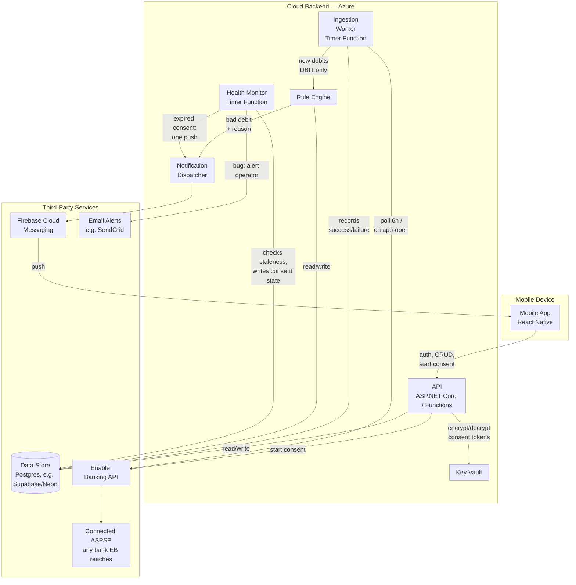

# Architecture

Status: decided at a high level; not yet implemented. Written after the mocks settled, per the
project's mocks-first ordering, then **reconciled with `REQUIREMENTS.md` on 2026-08-17**.

## Reconciliation with `REQUIREMENTS.md`

All ten divergences found on 2026-08-14 are folded into the text below:

| | What was wrong or missing | Where it now lives |
|---|---|---|
| `A1` | Rule engine evaluated the amount for **bad** payees | "Rule engine" — the amount applies to **good** payees only (R5) |
| `A2` | Consent-expiry push explicitly ruled out | "Consent lifecycle" — Health Monitor → dispatcher → FCM (R19) |
| `A3` | Frequency/count thresholds | removed everywhere; amount is the only threshold |
| `A4` | `debitor` / `Trusted`+`Bad` / `Transactions` | renamed to payee / good+bad / debits (R0) |
| `A5` | Nothing filtered incoming money | "What counts as a debit" — keep `DBIT` (R2a) |
| `A6` | Payee identity was one phrase | "Payee identity" — two-tier best-effort key (R3a) |
| `A7` | Derived-vs-stored classification unstated | "Classification is derived, never stored" (R6/R7) |
| `A8` | Reconnect-after-a-gap unhandled | "Ingestion modes" — the third mode (R20) |
| `A9` | No data lifecycle for R18 | "Data lifecycle" |
| `A10` | N26 treated as *the* bank | "Bank-agnostic design" (R22) |

`A6` was still open when the rest was reconciled; Enable Banking's support answered on 2026-08-17
and closed it. The same answer forced a change nobody asked for: **the de-duplication key was
wrong**, so "Debit identity" is rewritten around `(account, entry_reference)` on booked charges —
see that section and R10b/R10c.

Both keys are documentation-and-support answers, not observed behavior. They get a tuning pass
against real data — see "Refining this from real data".

`A4` deliberately stops at the product vocabulary. Bank-facing names keep their own: Enable
Banking's **transaction feed** and its `transaction_id` field are not renamed (R0) — though note
that field turned out to be unusable as an identifier.

## Component diagram

| Component | Tech | Execution place | Responsibility |
|---|---|---|---|
| Mobile App | React Native | Mobile device | UI (debit list/detail, rules, settings), receives push, in-app classification |
| API | ASP.NET Core / Azure Functions (HTTP), C# | Cloud backend | Auth, payee/rule CRUD, debit history, brokers Enable Banking consent flow |
| Ingestion Worker | Azure Functions (Timer), C# | Cloud backend | Polls every 6h per consent (retries transient failures), plus on-demand fetch when the app is open; records success/failure per consent. Drops credits (R2a). Runs in one of three modes — see "Ingestion modes" |
| Health Monitor | Azure Functions (Timer), C# | Cloud backend | Daily check for consents stuck failing 20h+; expired consents get a user-facing banner **and one push**, everything else an email alert to the operator |
| Rule Engine | C# | Cloud backend | Resolves payee → applies that payee's rule (R5) → hands bad debits to the dispatcher **with the reason** (R12a) |
| Notification Dispatcher | C# | Cloud backend | Words the notification from the reason and sends it via FCM; the alert decision belongs to the Rule Engine only |
| Key Vault | Azure Key Vault | Cloud backend | Holds the encryption key for BankConsent tokens |
| Data Store | Postgres (free tier, e.g. Supabase/Neon) | Third party | Users, BankConsents (encrypted), Payees, Rules, Debits, NotificationLog, poll status per consent |
| Enable Banking API | PSD2/XS2A aggregator | Third party | Consent flow, transaction feed |
| Connected ASPSP | Any bank Enable Banking reaches | Third party | Source of truth for the account's transactions. N26 is the first one integrated, not a fixed dependency (R22) |
| Firebase Cloud Messaging | Push service | Third party | Push delivery to APNs + Android |
| Email Alerts | e.g. SendGrid | Third party | Notifies the operator when ingestion is failing for a non-consent reason |

## Client

**React Native.** Considered .NET MAUI and Flutter.

- Mocks in `mocks/` are Flexbox HTML/CSS by deliberate choice, so they map closely to RN
  components.
- Given the intent to commercialize later, RN's ecosystem (subscription/monetization SDKs
  like RevenueCat, analytics, A/B testing) and larger hiring pool tipped the decision over
  Flutter. Flutter's main edge (pixel-consistent rendering, smoother animation) matters less
  for this app's plain list/card/settings UI.
- MAUI was attractive given existing C# experience, but was dropped due to a thinner
  ecosystem for the two riskiest integrations (bank consent webview flow, push
  notifications).

## Backend

Separate service from the client — its language doesn't need to match RN. **ASP.NET Core /
Azure Functions (C#)**, leveraging existing team experience for the reliability-critical half
of the system.

Components:

- **API** — auth, payee/rule CRUD, debit history for the app's list/detail screens, and
  brokering the Enable Banking consent flow (session start + redirect callback, encrypted
  token storage).
- **Ingestion worker** — see below.
- **Rule engine** — see below.
- **Notification dispatch** — Firebase Cloud Messaging (unified path to APNs + Android).
- **Data store** — Users, BankConsents (encrypted), Payees, Rules, Debits (cache), and a
  light NotificationLog.

### Rule engine

On each newly-seen debit: resolve the payee (see "Payee identity"), read that payee's rule, and
apply R5 exactly as the spec states it:

| Rule for the payee | Result | Reason handed to the dispatcher |
|---|---|---|
| No rule | **bad** | `NewPayee` |
| Bad | **bad** — the amount is **not** consulted | `MarkedBad` |
| Good, no amount | **good** | — |
| Good, amount set, debit ≤ amount | **good** | — |
| Good, amount set, debit > amount | **bad** | `OverLimit` (carries the limit) |

Two details are easy to get backwards and both break R1 if they are:

- **The amount belongs to the *good* branch only.** A bad payee alerts on every charge, whatever
  its size. Evaluating a leftover limit for a bad payee would silence exactly the payees the user
  flagged on purpose. (This was `A1`, and it was written the wrong way round here until
  2026-08-17.)
- **Equality is good** (R5a): a charge exactly equal to the limit does not exceed it, so `>`,
  never `>=`.

The comparison uses the **booked amount in the account currency** (R16) — what actually left the
account. If the bank also reports an original foreign amount, it is passed through for display on
the debit detail screen and never enters the comparison. There is no currency conversion anywhere
in the backend.

The engine does not word the notification; it hands over the reason and lets the dispatcher
render R12a's title and body. Keeping the wording in one place means the three bodies ("New payee
— you haven't seen this one before", "You marked this payee as bad", "Over your limit of «limit»")
cannot drift from the reasons that produce them.

### Classification is derived, never stored

Good/bad is **computed at read time** from the payee's current rule (R6) and never written onto
the debit record. R7 requires a rule edit to re-label that payee's existing debits immediately;
derived classification gets that for free, whereas a stored flag would need a re-labelling job
over history on every rule edit — more moving parts, and wrong in the window before it finishes.

The one thing that *is* persisted is **whether a debit has been seen before** (R10b) and whether
a notification was sent for it (NotificationLog). That is what keeps R10a honest: a debit that
turns bad later because the user edited a rule is re-labelled in the list on the next read, but
it is not new, so nothing notifies.

## Payee identity

Two different matching problems live in this system and they must not share a key:

| | Question | Key |
|---|---|---|
| **Payee identity** | "Is this the same party as last time?" | best-effort, this section |
| **De-duplication** | "Have I already seen this exact charge?" | `(account, entry_reference)`, see "Debit identity" |

**The exact key R3a wanted does not exist.** Enable Banking's support confirmed on 2026-08-17
that their transaction model carries no SEPA creditor identifier and no mandate ID, and they
could not point to a passthrough or roadmap item that would expose one — even though N26's own
PSD2 interface publishes both. `A6` is therefore designed around its absence rather than waiting
for it.

The key is two-tier, matching their own recommendation:

1. **Normalized creditor account identification** — the IBAN, where the charge carries one.
2. **Normalized name** (uppercase, strip digits and extra whitespace), plus the **creditor agent**
   where it separates two payees that would otherwise collide.

`reference_number` is explicitly not usable here: it is intended for credit-transfer references.

Consequences for the design:

- **Store every raw string ever seen for a payee**, alongside the resolved key (R3a). This is not
  bookkeeping — it is the only way to re-tune matching later against what banks actually sent,
  instead of guessing. See "Refining this from real data".
- **When matching is uncertain, split rather than merge** (R3b). A split shows a known payee as
  unknown → a false alert: annoying but safe. A merge lets an unknown payee inherit "good" → a
  missed alert, which breaks R1. With a fuzzy key, ambiguity is the normal case, so this rule
  runs often.
- Matching degrades per-bank rather than failing (R22): the creditor account is missing for some
  ASPSPs and some charge types, and tier 2 has to carry those alone.
- Direct debits get the weakest matching, which is the product's most important charge type.
  Accepted, not solved.

## What counts as a debit

Enable Banking returns both directions of money. R2a says incoming money is ignored **entirely**:
never listed, never notifies, never creates a payee. The filter lives in the ingestion worker, at
the earliest possible point — before payee resolution, so a credit cannot bring a payee into
existence.

The field is `credit_debit_indicator`, whose only values are `CRDT` and `DBIT`; **keep `DBIT`**.
Without this, the user's first salary payment creates a payee with no rule, which classifies bad
(R5) and fires a notification.

Accepted side effect, straight from R2a: a refund from a bad payee is invisible in the app.

## Transaction ingestion: polling, not webhooks

Verified against Enable Banking's docs: webhooks only exist for **payment status** (PIS,
outgoing payments initiated through them), not for account information / new transactions.
There is no push mechanism for "a new transaction appeared" — it must be polled via
`GET /accounts/{account_id}/transactions`.

The binding constraint is on the bank side, not Enable Banking's own limits: most ASPSPs cap
**background** data fetches — i.e. when the end user isn't actively in the app — at **4 times
per day**, backing off 6 hours on `ASPSP_RATE_LIMIT_EXCEEDED`.

**That cap is per-ASPSP and will differ between banks** (R22). The 6h cadence below is a safe
default, not a constant: the poll interval is configuration held per ASPSP, so a stricter bank
can be slowed down without touching the worker. `ASPSP_RATE_LIMIT_EXCEEDED` is handled as a
normal backoff signal for any bank rather than treated as a bug.

Given the product owner's call that same-day notification is an acceptable user experience
(not instant), the design is:

- A timer-triggered poll every **6 hours** (4x/day) per active consent — sits exactly at the
  ASPSP background limit with no rate-limit risk, worst-case latency ~6h.
- When the user has the app open, trigger an **on-demand fetch with PSU headers** (their
  IP/user-agent). Enable Banking's background-fetch limit doesn't apply when there's a
  signal of an active user session, so this is effectively a free "refresh on open" outside
  the 4x/day quota.

## Ingestion modes

The worker has **three** modes, all sharing one fetch path. They differ only in what happens to
the debits that come back — which matters because R10b makes "new" mean "an unseen bank
identifier" (see "Debit identity"), so anything the app has never pulled before would otherwise
notify.

| Mode | When | What happens to the debits |
|---|---|---|
| **First run** | First poll after a consent is granted | Full available history, stored as **already seen**, routed to the onboarding classify screen (`01c-classify-payees.html`) — never to the Rule Engine. No notifications (R10b) |
| **Steady state** | Every 6h poll, and on-demand when the app is open | Incremental diff → Rule Engine → one push per bad **booked** debit (R10, R11, R10c) |
| **Reconnect** | First poll after a gap — expired consent re-authorized, or reconnect after Disconnect | Everything from the gap goes through the Rule Engine, but the dispatcher sends **one summary push**: "12 new charges while you were disconnected, 3 bad" (R20) |

Reconnect is the mode that did not exist before 2026-08-17 (`A8`). Without it, a user coming back
after two weeks gets one push per bad charge in a single burst — R20 exists precisely to prevent
that, and it is a deliberate exception to R11. Normal per-charge alerts resume with the next
steady-state poll.

The alternative shapes were rejected for the same reason each time: a separate "Initial Sync"
component would duplicate the Enable Banking fetch logic, and suppressing the burst in the
dispatcher (rather than making the mode explicit) would hide a rule the spec states outright. The
cost is a worker with three modes to keep straight, which is worth an explicit test each.

## Debit identity — never alert twice for one charge

Rewritten 2026-08-17, after Enable Banking's support answered. The previous design keyed debits
on "the bank-issued transaction ID" and assumed that ID survived a status change. **Both halves
were wrong**, and the correction is more consequential than the question that produced it.

**The key is `(connected account, entry_reference)`.** `entry_reference` is documented as unique
and immutable for the same account and matches across authentication sessions, but it is *not*
globally unique — hence the account scope, which the app has anyway (R22a: one account at a time).

**`transaction_id` must not be used for this.** It exists to fetch transaction details, is not
guaranteed to identify a transaction uniquely, and **may change between fetches** — a de-dup key
that changes under you is worse than no key, because the failure is a burst of duplicate alerts
for charges the user already saw.

**Only booked debits notify (R10c).** There is no identifier that reliably survives pending →
booked: for most ASPSPs `entry_reference` only exists once the charge is booked. So:

- Pending items may be shown in the list as provisional, and are excluded from identifier-based
  matching.
- The Rule Engine evaluates a debit the first time its key is seen **in booked state**, and does
  not re-alert on any later change.
- Where an ASPSP demonstrably supplies an `entry_reference` that is already present while pending
  and unchanged at booking, that bank may alert earlier — a per-ASPSP capability, never an
  assumption (R22).

The cost is latency: an alert waits for the bank to book the charge, typically under a day, which
the "same-day notification is acceptable" decision already covers. The alternative doubles up on
every bank that re-keys at booking, and a false "you were charged twice" is worse than an alert a
few hours later.

This is R10b's real meaning, and it is why "new" is never a date comparison: banks deliver late,
and a charge booked three days ago still deserves its alert the first time the app sees it.

**When the key is unreliable, risk the duplicate, never the miss.** Some ASPSPs omit entry
references entirely, some hand out duplicates, and Enable Banking generates synthetic references
only under certain conditions. Where the key cannot be trusted, the worker treats the charge as
new. Note this is the *opposite* direction from payee identity above, and for the same reason:
there, merging two payees loses an alert; here, merging two charges loses one.

## Reliability: poll health monitoring

The product's core promise — never miss a genuinely new bad charge — depends entirely on the
6h poll actually running for every user every cycle. A silently failing poll would break that
promise without anyone noticing, so this gets explicit handling rather than being left to
chance:

1. The Ingestion Worker retries transient failures automatically (a few attempts with
   backoff) before giving up on a given run.
2. Every poll attempt — success or failure — is recorded per consent (`LastAttemptAt`,
   `LastSuccessAt`, `LastError`).
3. A separate daily Health Monitor job looks for any consent whose last successful poll is
   more than 20h old (a one-cycle buffer over the 6h cadence) and branches on why:
   - **Expired/revoked consent** — user-fixable, not a bug. It reaches the user two ways
     (R19), and no operator alert: the consent state is written to the data store, which the
     app reads to show the persistent banner over the debit list
     (`01d-connection-expired.html`), **and** the Health Monitor hands the dispatcher one push.
   - **Anything else** (API error, unexpected exception) — this means monitoring is broken
     for reasons the user can't fix themselves, so it emails the operator directly.

This keeps operator alerts limited to the failures that actually need a human to intervene.

## Consent lifecycle

PSD2 access consents expire periodically (commonly ~90 days) and need re-authorization. This
needs its own check/notification path, independent of the transaction poller.

**A dead connection is never silent (R19).** No alerts arriving looks exactly like "nothing bad
happened" — the one failure mode that breaks R1 while appearing to work perfectly. So expiry
gets both channels:

- **A persistent in-app banner** over the debit list for as long as the connection is expired or
  disconnected (`01d-connection-expired.html`). The list stays visible underneath it.
- **One push**, when the consent expires by itself. This is the half that was ruled out here
  until 2026-08-17 (`A2`): the banner only reaches a user who opens the app, and a user who has
  not opened it in a week is exactly the one who needs telling. It is sent once per expiry, not
  per failed poll — the NotificationLog is what keeps it from repeating every day.

Re-authorizing puts the worker into **reconnect** mode, so the backlog arrives as R20's single
summary rather than a burst. Rules stay editable throughout (R21) — nothing in the API refuses
writes while a consent is dead.

## Data lifecycle

R18 gives the connection three ways to end, and they are **not** the same operation underneath:

| How it ends | Rules | History | Connection |
|---|---|---|---|
| Consent expires on its own (~90 days) | kept | kept | re-authorize to resume |
| User taps Disconnect (`06b`) | kept | kept | reconnect anytime |
| User deletes the account (`06c`) | wiped | wiped | gone, not undoable |

Consequences for the backend:

- **Expiry and Disconnect differ only in intent**, not in data: both revoke the consent and stop
  polling, and both leave Payees, Rules and Debits intact. Disconnect additionally means "do not
  nag me" — no expiry push for a connection the user switched off themselves.
- **Account deletion is a real delete**, not a soft-delete flag: Users, BankConsents (and their
  Key Vault-encrypted tokens), Payees, Rules, Debits and NotificationLog entries all go. The mock
  (`06c`) states it is not undoable, so there is no recovery path to design and no orphaned
  consent to leave behind at Enable Banking — revoke there too, before deleting locally.

## Bank-agnostic design

R22: any ASPSP Enable Banking reaches is a valid target. **N26 is the first bank integrated, not
a dependency** — nothing in the data model, rule logic or copy may assume it. v1 still connects
one account at a time (R22a); simultaneous multi-bank support stays deferred.

What this costs the design, concretely:

- The poll cadence is per-ASPSP configuration, because the background-fetch cap differs by bank
  (see "Transaction ingestion").
- Neither key can rely on fields only some ASPSPs populate: the creditor account is missing for
  some banks and charge types ("Payee identity"), and `entry_reference` is omitted or duplicated
  by others ("Debit identity"). Both degrade per-bank instead of failing.
- The consent flow is parameterized by ASPSP from the start. The app needs a bank-selection
  screen that does not exist in the mocks yet; it is listed as known mock gap 4 in
  `REQUIREMENTS.md`.

## Cost

Enable Banking gives free "Restricted Production" access for accounts you personally link,
matching the project's zero-cost-to-start decision and its current single-user scope. That tier
is limited by *whose* accounts you link, not by which bank — so adding ING-DiBa or DKB alongside
N26 costs nothing extra (R22). Paid, volume-based pricing (unpublished, contact-sales) only
becomes relevant once onboarding other people's accounts at commercial scale.

On Azure: Functions (consumption plan), the storage account behind them, and Key Vault are
all effectively free at this scale. Azure SQL was the one component with a real baseline
cost even serverless, which is why the data store moved to a free-tier Postgres host
(Supabase/Neon) instead — keeps the whole backend at zero cost to start.

## Accepted tradeoffs

- **On-demand fetch cold start**: the app-open on-demand fetch runs on Azure Functions'
  consumption plan, which can take a few seconds to wake up if idle. Accepted as-is (no
  Premium plan, to keep costs at zero) — the syncing screen's UI should be designed to feel
  intentional during this wait rather than stuck.

## Open questions

- Confirm the "4x/day background" limit **per bank** — it is documented as ASPSP-general
  behavior and verified for none of them, N26 included. The poll cadence is per-ASPSP config
  precisely because this answer may differ for ING-DiBa or DKB.
- Enable Banking's own request rate limits/quotas on the free tier are not published —
  worth confirming before scaling beyond a handful of users.
- ~~Which of the three identifiers is stable~~ — answered 2026-08-17: `entry_reference`, scoped
  per account, booked only; `transaction_id` may change between fetches; `reference_number` is
  for credit transfers. See "Debit identity".
- ~~Whether the SEPA creditor identifier / mandate ID can be reached~~ — answered 2026-08-17: no,
  and no passthrough or roadmap item they could point to. See "Payee identity".
- **The two answers above came from Enable Banking's AI support agent, not a human**, and on the
  creditor-ID question it said outright that it could not confirm from the available
  documentation. The two-tier key is designed to survive either way, so this is worth a human
  confirmation only if we ever want the exact key back.

## Refining this from real data

**Settled 2026-09-16 against a real N26 account** — full evidence in `TRACER-BULLET.md`, "What
real N26 data said." R3a's payee key and R10b's de-dup key held up under evidence rather than
guesswork:

- R10b's composite fallback (`account, day, amount, payee, ordinal`) is not a stopgap for banks
  that omit `entry_reference`: on this account, 63 of 91 real debits still needed it even though
  the field exists and is populated on the other 28. Any ASPSP integration should expect to use
  both keys, per row, indefinitely — not treat the fallback as something later data retires.
- The account-holder's-own-IBAN trap (a credit row's `creditor_account` equal to the connected
  account's own IBAN) reproduces on live data exactly as the curated test fixture modeled it —
  confirms R2a's filter belongs before payee resolution, at the earliest point in the pipeline.
- `ConnectedAccount.Key` being the IBAN rather than the session `uid` is now validated across an
  environment change (sandbox → production), not only a consent renewal within one environment —
  the `uid` changed again, the IBAN did not.

Still unobserved from any account, sandbox or production: a non-EUR charge and a pending
transaction. R10c's booked-vs-pending split and the currency-skip path remain built from the
requirement's wording, not from evidence, and should stay conservative until one actually arrives.
