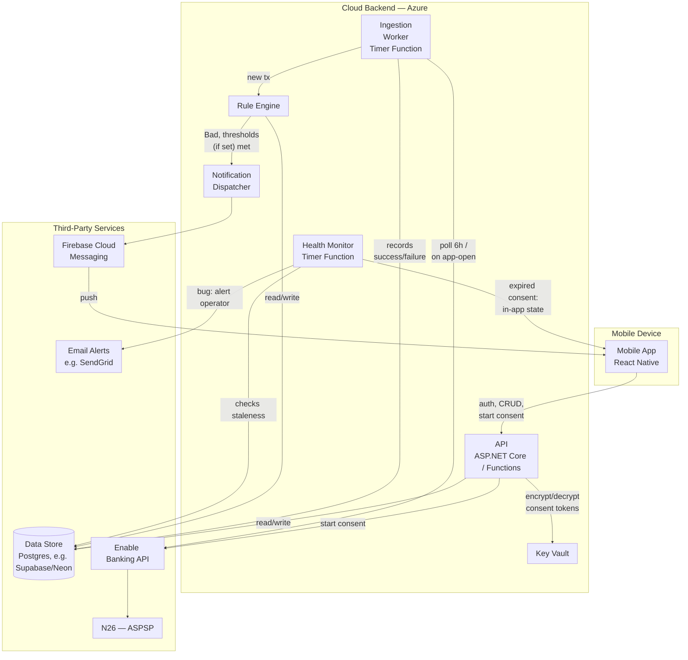

# Architecture

Status: decided at a high level; not yet implemented. Written after the mocks settled, per
the project's mocks-first ordering.

## Component diagram

| Component | Tech | Execution place | Responsibility |
|---|---|---|---|
| Mobile App | React Native | Mobile device | UI (list/detail/rules/settings), receives push, in-app classification |
| API | ASP.NET Core / Azure Functions (HTTP), C# | Cloud backend | Auth, debitor/rule CRUD, tx history, brokers Enable Banking consent flow |
| Ingestion Worker | Azure Functions (Timer), C# | Cloud backend | Polls every 6h per consent (retries transient failures), plus on-demand fetch when the app is open; records success/failure per consent. First run per consent is a bulk historical pull feeding onboarding classify, not the Rule Engine |
| Health Monitor | Azure Functions (Timer), C# | Cloud backend | Daily check for consents stuck failing 20h+; routes expired-consent cases to in-app state, everything else to an email alert |
| Rule Engine | C# | Cloud backend | Matches counterparty → debitor, evaluates Trusted/Bad + amount/count thresholds (AND logic) |
| Notification Dispatcher | C# | Cloud backend | Sends the push via FCM; alert decision belongs to the Rule Engine only |
| Key Vault | Azure Key Vault | Cloud backend | Holds the encryption key for BankConsent tokens |
| Data Store | Postgres (free tier, e.g. Supabase/Neon) | Third party | Users, BankConsents (encrypted), Debitors, Transactions, NotificationLog, poll status per consent |
| Enable Banking API | PSD2/XS2A aggregator | Third party | Consent flow, transaction feed |
| N26 | ASPSP (bank) | Third party | Source of truth for transactions |
| Firebase Cloud Messaging | Push service | Third party | Push delivery to APNs + Android |
| Email Alerts | e.g. SendGrid | Third party | Notifies the operator when ingestion is failing for a non-consent reason |

## Client

**React Native.** Considered .NET MAUI and Flutter.

- Mocks in `mocks/` are Flexbox HTML/CSS by deliberate choice, so they map closely to RN
  components.
- Given the intent to commercialize later, RN's ecosystem (subscription/monetization SDKs
  like RevenueCat, analytics, A/B testing) and larger hiring pool tipped the decision over
  Flutter. Flutter's main edge (pixel-consistent rendering, smoother animation) matters less
  for this app's plain list/card/settings UI.
- MAUI was attractive given existing C# experience, but was dropped due to a thinner
  ecosystem for the two riskiest integrations (bank consent webview flow, push
  notifications).

## Backend

Separate service from the client — its language doesn't need to match RN. **ASP.NET Core /
Azure Functions (C#)**, leveraging existing team experience for the reliability-critical half
of the system.

Components:

- **API** — auth, debitor/rule CRUD, transaction history for the app's list/detail screens,
  and brokering the Enable Banking consent flow (session start + redirect callback, encrypted
  token storage).
- **Ingestion worker** — see below.
- **Rule engine** — on each new transaction: match counterparty → debitor → Trusted/Bad →
  if Bad, evaluate amount/count thresholds (AND logic, per settled product decision). The
  count threshold's "period" is a rolling window (e.g. last N days), not a calendar
  month/week — more intuitive for the user, no confusing reset at a boundary.
- **Notification dispatch** — Firebase Cloud Messaging (unified path to APNs + Android).
- **Data store** — Users, BankConsents (encrypted), Debitors, Transactions (cache), and a
  light NotificationLog.

## Transaction ingestion: polling, not webhooks

Verified against Enable Banking's docs: webhooks only exist for **payment status** (PIS,
outgoing payments initiated through them), not for account information / new transactions.
There is no push mechanism for "a new transaction appeared" — it must be polled via
`GET /accounts/{account_id}/transactions`.

The binding constraint is on the bank side, not Enable Banking's own limits: most ASPSPs
(N26 included, presumptively) cap **background** data fetches — i.e. when the end user isn't
actively in the app — at **4 times per day**, backing off 6 hours on
`ASPSP_RATE_LIMIT_EXCEEDED`.

Given the product owner's call that same-day notification is an acceptable user experience
(not instant), the design is:

- A timer-triggered poll every **6 hours** (4x/day) per active consent — sits exactly at the
  ASPSP background limit with no rate-limit risk, worst-case latency ~6h.
- When the user has the app open, trigger an **on-demand fetch with PSU headers** (their
  IP/user-agent). Enable Banking's background-fetch limit doesn't apply when there's a
  signal of an active user session, so this is effectively a free "refresh on open" outside
  the 4x/day quota.

## Initial sync vs steady-state polling

First poll after consent is different from every poll after: there's no "last-seen"
transaction to diff against, and the result feeds the onboarding bulk-classify screen
(`01c-classify-debitors.html`), not the Rule Engine — no notifications should fire for
pre-existing history.

Handled as a first-run mode inside the Ingestion Worker (not a separate component): same
fetch logic, but on first run for a consent it pulls full available history and routes it to
onboarding classify instead of the Rule Engine. Once the user finishes classifying, the
worker switches to normal incremental 6h polling for that consent.

Chosen over a separate "Initial Sync" component to avoid duplicating the Enable Banking
fetch logic in two places, at the cost of the worker having two modes to keep straight.

## Transaction identity

Bank transactions can change status (e.g. pending → booked) between polls. To avoid alerting
twice on the same charge: each transaction is keyed by its bank-issued transaction ID, kept
as one record that gets updated in place. The Rule Engine evaluates a transaction the first
time it's seen, regardless of status, and does not re-alert on a later status change alone.

Assumes Enable Banking gives a stable transaction ID across status changes — not yet
confirmed, see Open Questions.

## Reliability: poll health monitoring

The product's core promise — never miss a genuinely new Bad charge — depends entirely on the
6h poll actually running for every user every cycle. A silently failing poll would break that
promise without anyone noticing, so this gets explicit handling rather than being left to
chance:

1. The Ingestion Worker retries transient failures automatically (a few attempts with
   backoff) before giving up on a given run.
2. Every poll attempt — success or failure — is recorded per consent (`LastAttemptAt`,
   `LastSuccessAt`, `LastError`).
3. A separate daily Health Monitor job looks for any consent whose last successful poll is
   more than 20h old (a one-cycle buffer over the 6h cadence) and branches on why:
   - **Expired/revoked consent** — user-fixable, not a bug. Surfaced in-app via the existing
     `01d-connection-expired.html` state; no operator alert.
   - **Anything else** (API error, unexpected exception) — this means monitoring is broken
     for reasons the user can't fix themselves, so it emails the operator directly.

This keeps alerts limited to the failures that actually need a human to intervene.

## Consent lifecycle

PSD2 access consents expire periodically (commonly ~90 days) and need re-authorization. This
needs its own check/notification path, independent of the transaction poller — the mock
`01d-connection-expired.html` already anticipates this state.

## Cost

Enable Banking gives free "Restricted Production" access for accounts you personally link,
matching the project's zero-cost-to-start decision and current single-user/N26 scope. Paid,
volume-based pricing (unpublished, contact-sales) only becomes relevant once onboarding other
people's accounts at commercial scale.

On Azure: Functions (consumption plan), the storage account behind them, and Key Vault are
all effectively free at this scale. Azure SQL was the one component with a real baseline
cost even serverless, which is why the data store moved to a free-tier Postgres host
(Supabase/Neon) instead — keeps the whole backend at zero cost to start.

## Accepted tradeoffs

- **On-demand fetch cold start**: the app-open on-demand fetch runs on Azure Functions'
  consumption plan, which can take a few seconds to wake up if idle. Accepted as-is (no
  Premium plan, to keep costs at zero) — the syncing screen's UI should be designed to feel
  intentional during this wait rather than stuck.

## Open questions

- Confirm N26 specifically enforces the "4x/day background" limit (documented as an ASPSP-
  general behavior, not verified per-bank).
- Enable Banking's own request rate limits/quotas on the free tier are not published —
  worth confirming before scaling beyond a handful of users.
- Confirm Enable Banking gives a stable transaction ID that survives a status change
  (e.g. pending → booked), since the duplicate-alert prevention in Transaction identity
  depends on it.
